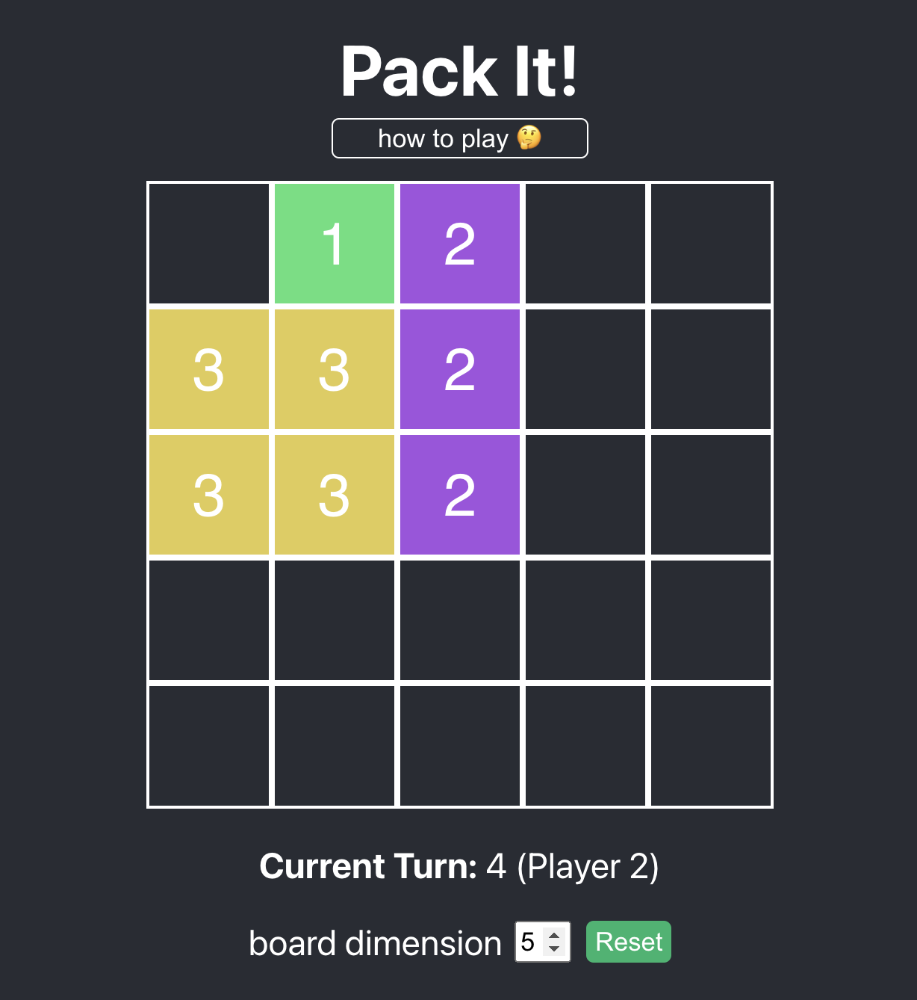
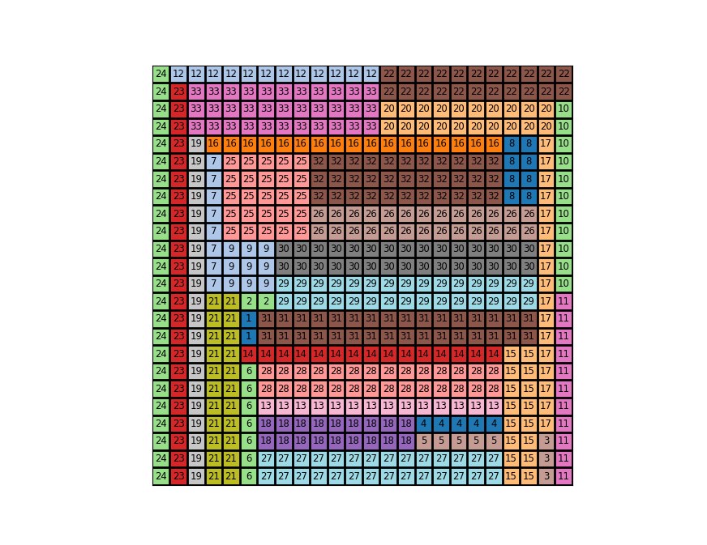
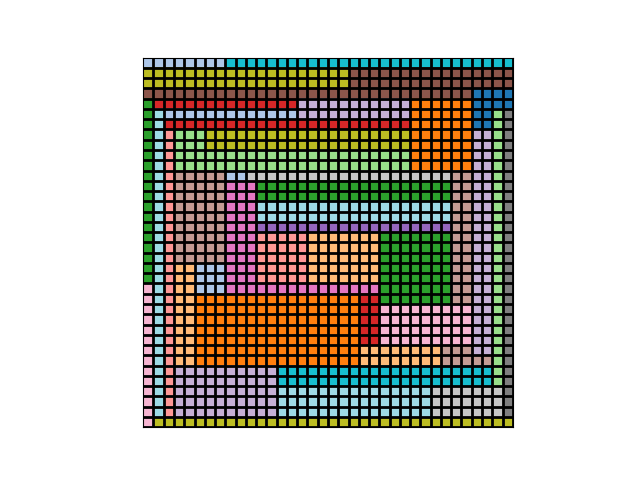
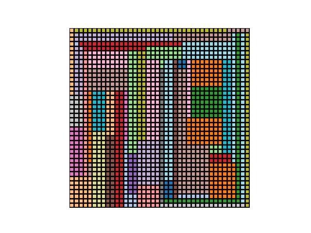
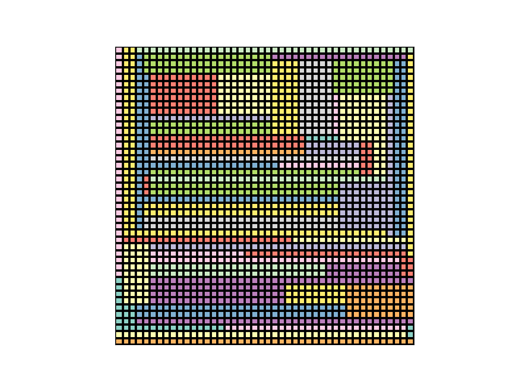

# Pack it!

Code related to the Pack it! game (idea of Thomas Garrison).

Pack it! is a two player game where players alternate turns placing rectangular tiles on an NxN grid. The rules are quite simple: on turn i (starting from 1), the current player (i % 2 ? 1 : 2) can place a rectangular tile of area i or i+1, that doesn't overlap with existing tiles. A player that cannot place any tiles on their turn loses!

## On the web 

I made a small React implementation of the game, which is publicly available at [packit.surge.sh](packit.surge.sh).

TODO: implement web sockets so it supports to players competing from different computers.

## Perfect Pack it! games.

A game of Pack it! is said to be perfect if it ends by a tile that fully completes the NxN grid.
A natural question therefore is for what values of N a perfect game of Pack it! exists.
We address this question computationally by combining a local search solver (LocalSolver) with a SAT solver.

Here are some pictures of perfect Pack it! games:

